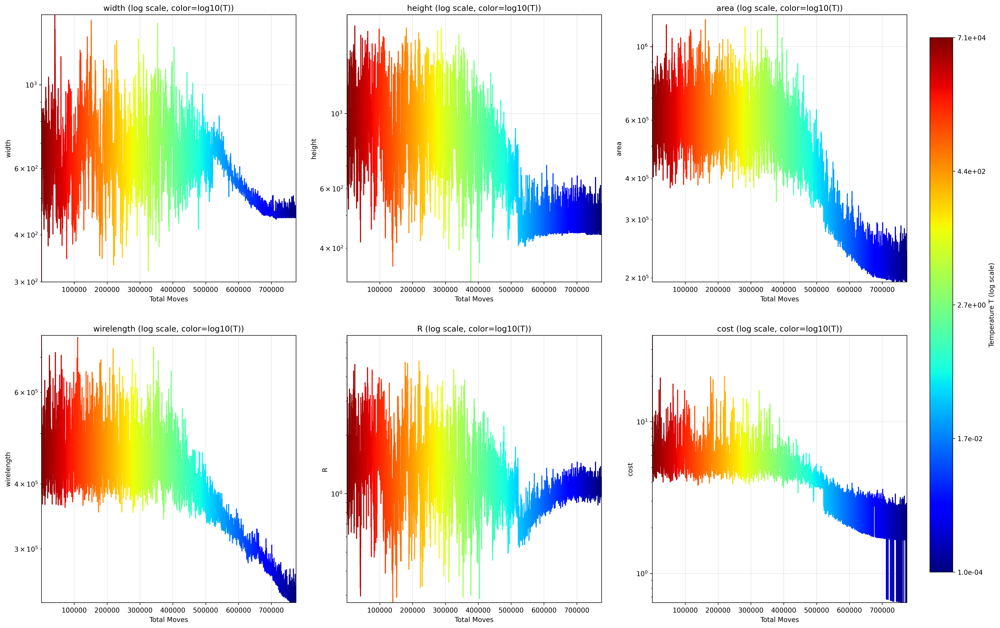
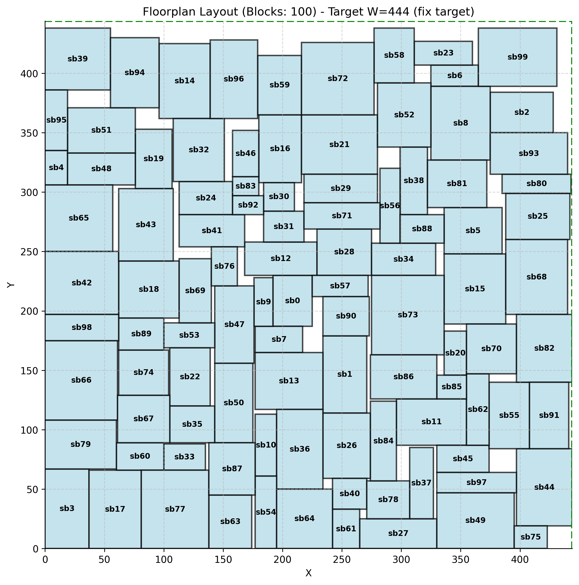
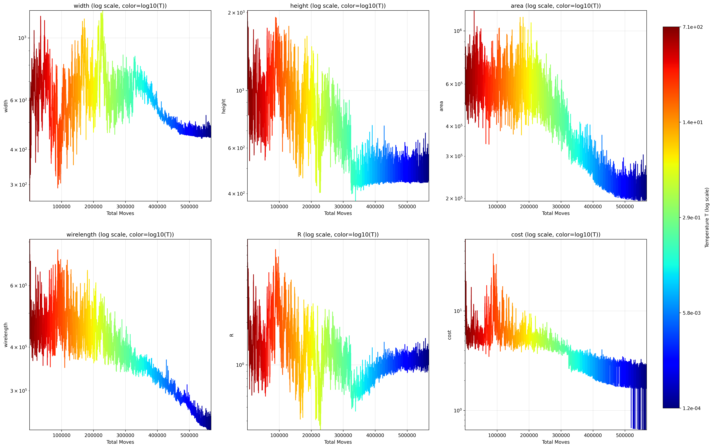
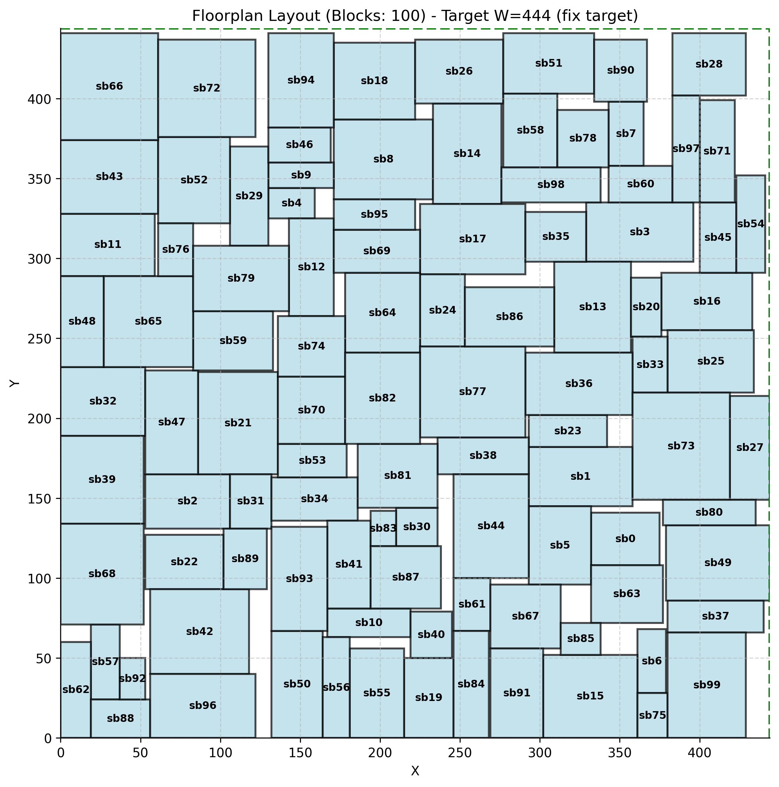

# 实验设计

## 1.对原始基线算法和改进的GMS算法进行多种子实验和曲线实验

### ①多种子实验

**对原始基线算法和改进的GMS算法进行多种子实验**

#### 1）原始算法

- 脚本会生成100个随机种子
- 空白率为0.1
- 基线算法 `-a 0`参数
- 模块规模为n100（默认）

```bash
#./test_experiments
python test_scripts.py --num_runs 100 --white_space_ratio 0.1 -a 0
```

#### 2）GMS

***做该实验前请先运行完100次的基线算法实验以保证100个种子已随机生成***

种子文件会以时间戳的名字保存在 `.seeds/`文件夹下，e.g.

`seeds_100_2026-06-06_19:50:59.txt`

请将最新时间戳的种子文件更名，以便后续实验，这里实例命名为

`seeds_100_test1`

- 由于基线算法实验已生成100个随机种子，为保证公平性，这里保持100个种子不变
- 空白率0.1
- 模块规模n100

**开始实验：** 执行下面的脚本代码

```bash
#./test_experiments
python test_scripts.py --num_runs 100 --white_space_ratio 0.1 -a 1 --seed_file ./seeds/seeds_100_test1.txt
```

最终将得到2个log日志文件，它们会详细记录不同的种子下的结果，其中 `算法模式：0`表示的是原始基线算法，而 `算法模式：1`表示的是GMS算法

将原始基线算法生成的日志命名为 `original_100_seeds_test1`，并将GMS算法生成的日志命名为 `GMS_100_seeds_test1`以方便进行对比

### ①曲线实验

我们从 `original_100_seeds_test1`和 `GMS_100_seeds_test1`这2个日志文件中找到同时都Found feasible solution的种子，并以那一个种子进行曲线实验。

例如这里找到 `356169864`作为统一的曲线实验种子。

首先在./seeds文件夹下创建一个种子文件命名为 `seeds_1_curve_test1.txt`，并将刚刚找到的统一的种子输入进去

#### 1）原始算法

运行以下脚本以记录曲线

```bash
#./test_experiments
python test_scripts.py --num_runs 1 --white_space_ratio 0.1 -a 0 --seed_file ./seeds/seeds_1_curve_test1.txt --record_curve
```

得到最新的log文件，请更名为 `original_1_curve_test1`

然后进行曲线图像的绘制，这里总共会绘制出11张图，包括['width', 'height', 'area', 'wirelength', 'R', 'cost', 'T']这些参数随总扰动次数变化的曲线热力图，共7张，1张总图，2张最高温和2张最低温对应温度下扰动拒绝和接受次数随该温度下扰动次数的变化曲线图。

**绘图：** 请运行以下脚本进行绘图（注意：这里脚本会默认读取最新的曲线数据并绘制，故请留意对应的实验曲线结果是否为最新，若不是请手动指定）

```bash
# 先进入 ./scripts 文件夹
cd ./scripts
python draw_curve.py
```

**原算法总图**



若想要查看具体的布图输出图像，可执行下列脚本

```bash
# 批量模式：自动读取 test_100blocks_ratio_0_1_total_1_algo0/ 下的所有 floorplan
python draw_fixed_outline.py --batch --num_hardblocks 100 --white_space_ratio 0.1 --num_runs 1 -a 0
```

原算法布图



#### 2）GMS

同样，运行以下脚本以记录曲线

```bash
#./test_experiments
cd ..
python test_scripts.py --num_runs 1 --white_space_ratio 0.1 -a 1 --seed_file ./seeds/seeds_1_curve_test1.txt --record_curve
```

得到最新的log文件，请更名为 `GMS_1_curve_test1`

**绘图：** 请运行以下脚本进行绘图（注意：这里脚本会默认读取最新的曲线数据并绘制，故请留意对应的实验曲线结果是否为最新，若不是请手动指定）

```bash
# 先进入 ./scripts 文件夹
cd ./scripts
python draw_curve.py
```

**GMS总图**



若想要查看具体的布图输出图像，可执行下列脚本

```bash
# 批量模式：自动读取 test_100blocks_ratio_0_1_total_1_algo0/ 下的所有 floorplan
python draw_fixed_outline.py --batch --num_hardblocks 100 --white_space_ratio 0.1 --num_runs 1 -a 1
```

**GMS布图**


